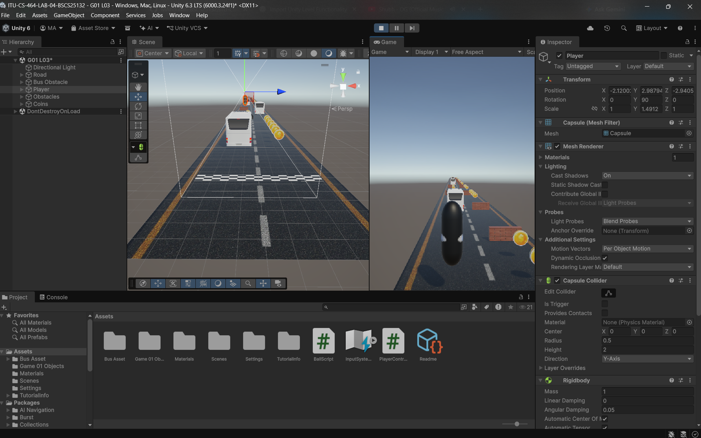

# ITU-CS-464-LAB-04-BSCS25132

## 🕹️ PlayerController Implementation

Implemented the **PlayerController** script to add basic player functionality to the game level.

## ▶️ How to Run

Clone this repository and open it in **Unity**. Open the scene named **`G01 L03`** and press **Play** to run the level.

### 📸 Level After Adding PlayerController

## Thank You Very Much 